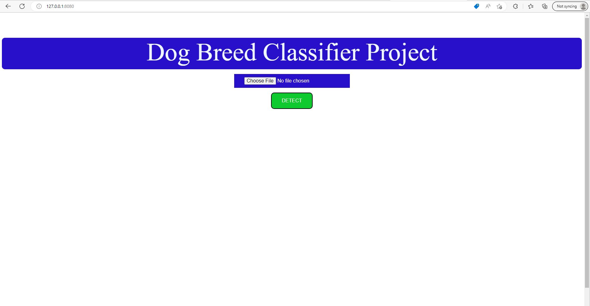
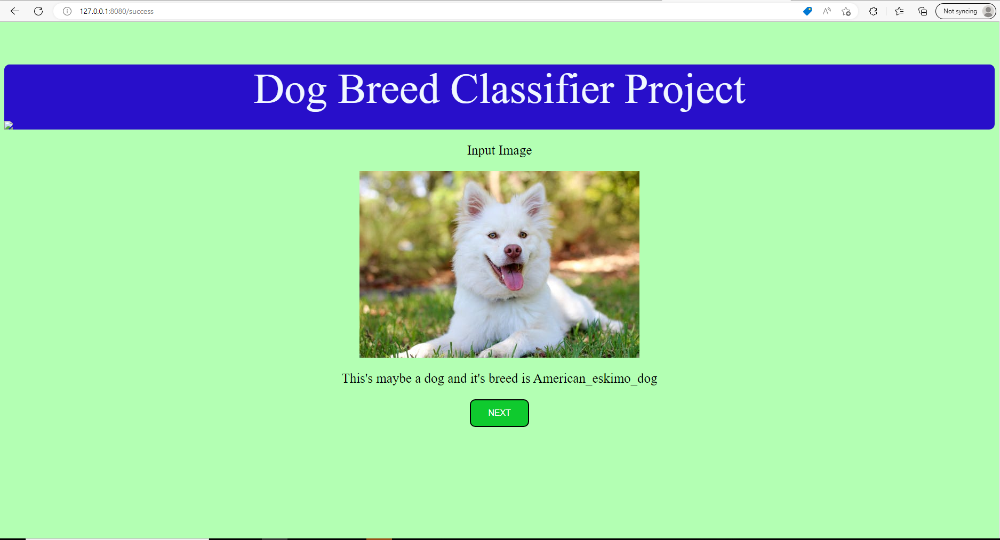

# ds-nano-udacity-capstone-project
# Dog Breed Project in DS Nano Program Udacity
A Web app (local) for detect dog breed. This's a part of Capstone project in Data
Scientist Nano Program Udacity

# Setup
* Install python 3.6.5
* Download source on git https://github.com/phucht95/ds-nano-udacity-capstone-project
or Clone with ```git clone https://github.com/phucht95/ds-nano-udacity-capstone-project.git```
* Install any python package dependencies ```pip install -r requirements.txt```


# How it Works
* Open terminal, go to project folder, type: ```python app.py``` 
* After that, open link on browser: http://127.0.0.1:8080/


* Upload file and click on DETECT
* Result after detected


* Click on NEXT to go to main page